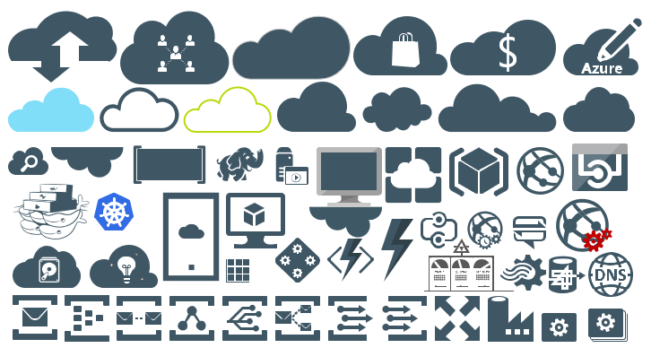

# Azure

## MIS Azure Stencils

This package contains stencils that will the original icons to represent the Azure Portal, Azure Services and Visual Studio Team Services features.

## MIS Azure Additional or Support Stencils

This package contains additional, less important or support stencils that will help you visually represent Microsoft Azure architectures or services (or Azure Products). It will provide stencils to visually represent additional Azure features or technologies.

## MIS Azure Old Versions

This package contains other less important or secondary Azure or related stencils, or different ways to represent Azure stencils like clouds or monochromatic shapes.

## MIS Azure Black and Gray

This package contains other less important or secondary Azure or related stencils, or different ways to represent Azure stencils like clouds or monochromatic shapes.

# About Me
**Sandro Pereira** | [DevScope](http://www.devscope.net/) | MVP & MCTS BizTalk Server 2010 | [https://blog.sandro-pereira.com/](https://blog.sandro-pereira.com/) | [@sandro_asp](https://twitter.com/sandro_asp)
