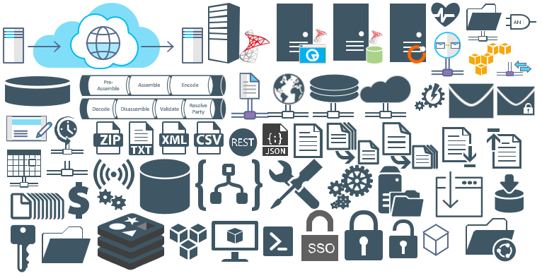
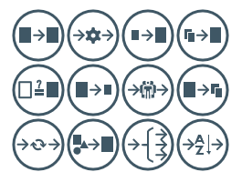

# Enterprise Integration

## Microsoft Integration Stencils 
This package now contains stencils that will help you visually represent Integration architectures (On-premise, Cloud or Hybrid scenarios) and solutions diagrams. It will provide stencils to visually represent features, systems, processes and architectures that use BizTalk Server, Microsoft Azure and related technologies

## MIS: Additional or Support
This package contains additional or support stencils that will help you visually represent Integration architectures (On-premise, Cloud or Hybrid scenarios) and solutions diagrams. It will provide stencils to visually represent features, systems, processes and architectures that use BizTalk Server, Microsoft Azure and related technologies

## MIS: Integration Patterns
This package contains stencils that will represent some Integration Patterns.

# About Me
Sandro Pereira | DevScope | MVP & MCTS BizTalk Server 2010 | [https://blog.sandro-pereira.com/](https://blog.sandro-pereira.com/) | [@sandro_asp](https://twitter.com/sandro_asp)
