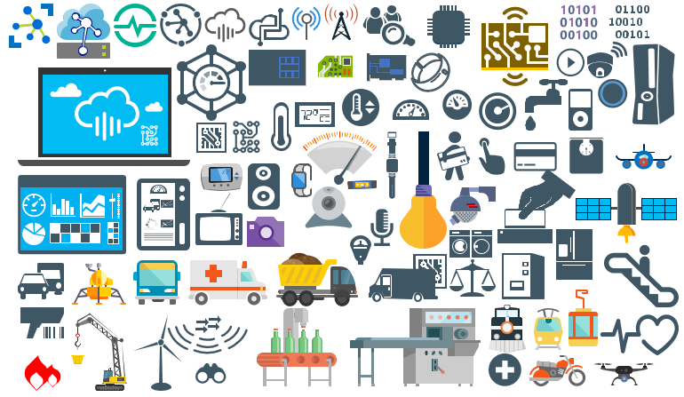

# IoT

## MIS: IoT
This package will provide stencils to visually represent IoT (Internet of Things) devices, architectures or solutions diagrams.

# About Me
**Sandro Pereira** | [DevScope](http://www.devscope.net/) | MVP & MCTS BizTalk Server 2010 | [https://blog.sandro-pereira.com/](https://blog.sandro-pereira.com/) | [@sandro_asp](https://twitter.com/sandro_asp)
