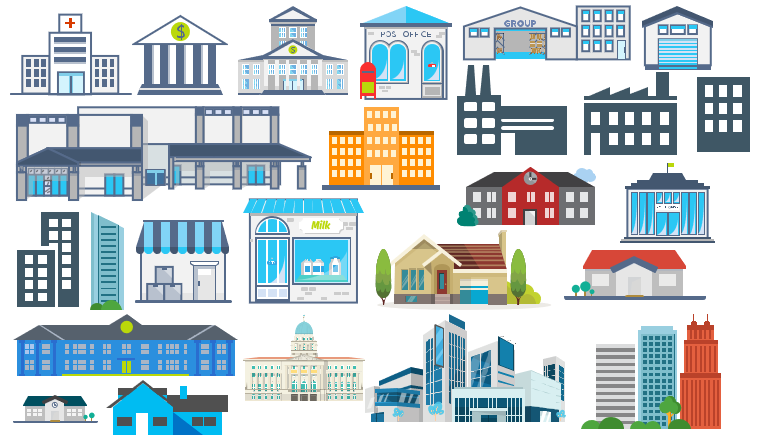
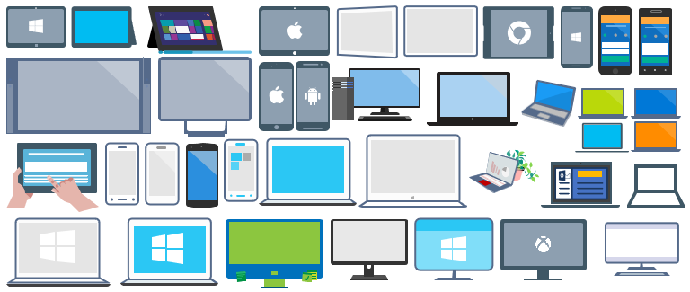
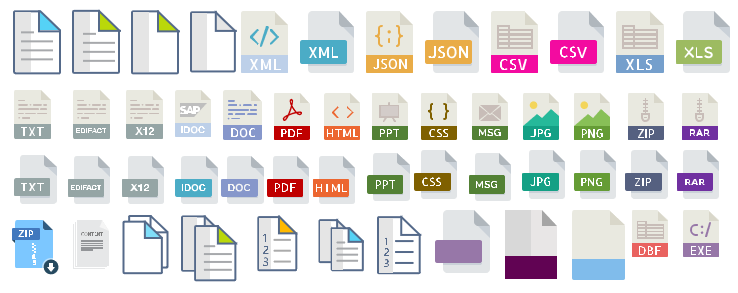
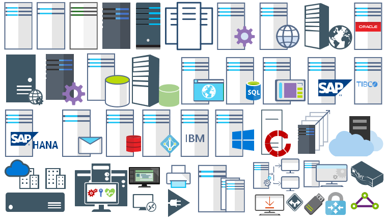
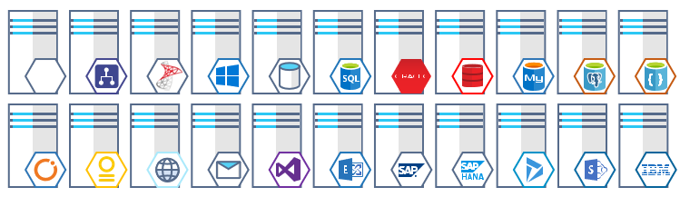
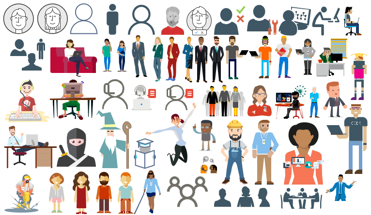

# Others

## MIS: Buildings
This package contains stencils that will represent Buildings/houses.

## Microsoft: Developer, SDK (Azure) and Tools
This package contains stencils that will represent programing languages, tools, SDK (Azure) or tecnologies and features for Developers.

## MIS: Devices
This package will provide stencils to visually represent devices: Surfaces, Tablets, Phones, PCs or laptops.

## MIS: Files
This package contains stencils that will represent file types.

## MIS: Generic
This package now contains general, additional or alternative stencils that will help you visually represent Integration architectures (On-premise, Cloud or Hybrid scenarios) and solutions diagrams. It will provide stencils to visually represent features, systems, processes and architectures that use BizTalk Server, Microsoft Azure, Office365 and related technologies.

## MIS: Infrastructure
This package will provide stencils to visually represent Infrastucture: servers, hardware, PCs, laptops, hard drives, memory, VHD, Hyper-V and so on.

## MIS: Servers (Hexagonal)
This package will provide stencils to visually represent Infrastucture: servers and Systems.

## MIS: Users and Roles
This package will provide stencils to visually represent Users, Teams and Roles.

# About Me
**Sandro Pereira** | [DevScope](http://www.devscope.net/) | MVP & MCTS BizTalk Server 2010 | [https://blog.sandro-pereira.com/](https://blog.sandro-pereira.com/) | [@sandro_asp](https://twitter.com/sandro_asp)
