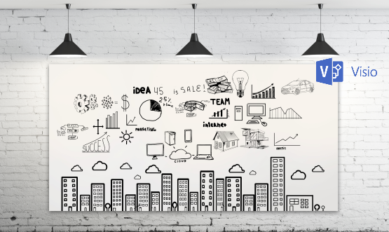
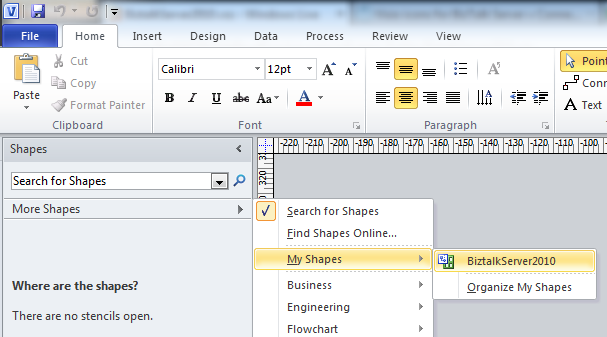

# Microsoft Integration, Azure, BAPI, Office 365 and much more Stencils Pack for Visio
Microsoft Integration, Azure, BAPI, Office 365 and much more Stencils Pack it’s a Visio package that contains fully resizable Visio shapes (symbols/icons) that will help you to visually represent On-premise, Cloud or Hybrid Integration and Enterprise architectures scenarios (BizTalk Server, API Management, Logic Apps, Service Bus, Event Hub…), solutions diagrams and features or systems that use Microsoft Azure and related cloud and on-premises technologies in Visio 2016/2013:
* BizTalk Server
* Microsoft Azure
  * Integration
    * Integration Service Environments (ISE)
    * Logic Apps and Azure App Service in general (API Apps, Web Apps and Mobile Apps)
    * Azure API Management
    * Messaging: Event Hubs, Event Grid, Service Bus, …
  * Azure IoT and Docker
  *	AI, Machine Learning, Stream Analytics, Data Factory, Data Pipelines
  * SQL Server, DocumentDB, CosmosDB, MySQL, ...
  * and so on
* Microsoft Power Platform
  * Microsoft Flow
  * PowerApps
  * Power BI
* Office365, SharePoint,...
* DevOps and PowerShell
* And much more…
* ... and now non-related Microsoft technologies like:
  * SAP Stencils

The Microsoft Integration Stencils Pack is composed of 27 files:

* Microsoft Integration Stencils
* MIS Additional or Support Stencils
* MIS Azure Stencils
* MIS Azure Additional or Support Stencils
* MIS Azure Black and Gray
* MIS Power Platform Stencils
* MIS Security and Governance
* MIS AI and Machine Learning Stencils
* MIS Apps and Systems Logo Stencils
* MIS Databases and Analytics Stencils
* MIS IoT Stencils
* MIS Office, Office 365 and Dynamics 365
* MIS SAP Stencils
* MIS Buildings Stencils
* MIS Developer Stencils
* MIS Devices Stencils
* MIS Files and Message Types Stencils
* MIS Generic Stencils
* MIS Infrastructure and Networking Stencils
* MIS Servers (Hexagonal) Stencils
* MIS Users and Roles Stencils
* MIS Integration Fun
* MIS Integration Patterns Stencils
* MIS Black and Cyan
* MIS Azure Old Versions
* MIS Deprecated Stencils
* Organisational Stencils

That you can use and resize without losing quality, in particular, the new shapes.

There are still many points that could be improved as well as adding new stencil, but it is a good start.

# Walkthrough video

A video walkthrough on the stencils integration with Visio Deskto

# Manual Installation process:

* Download the file and copy to the folder “%USERPROFILE%\Documents\My Shapes” (“C:\Users\you_user\Documents\My Shapes”; that is the default folder for the Visio custom shapes)
   * Delete all the previous files if exist.
* To access the shapes in Visio, select the Shapes Windows: 
  * “More Shapes -> My Shapes -> Microsoft Integration Stencils"
  * “More Shapes -> My Shapes -> MIS Azure Stencils"
  * “More Shapes -> My Shapes -> MIS Power Platform Stencils"
  * ...

# About Me
**Sandro Pereira** | [DevScope](http://www.devscope.net/) | MVP & MCTS BizTalk Server 2010 | [https://blog.sandro-pereira.com/](https://blog.sandro-pereira.com/) | [@sandro_asp](https://twitter.com/sandro_asp)

